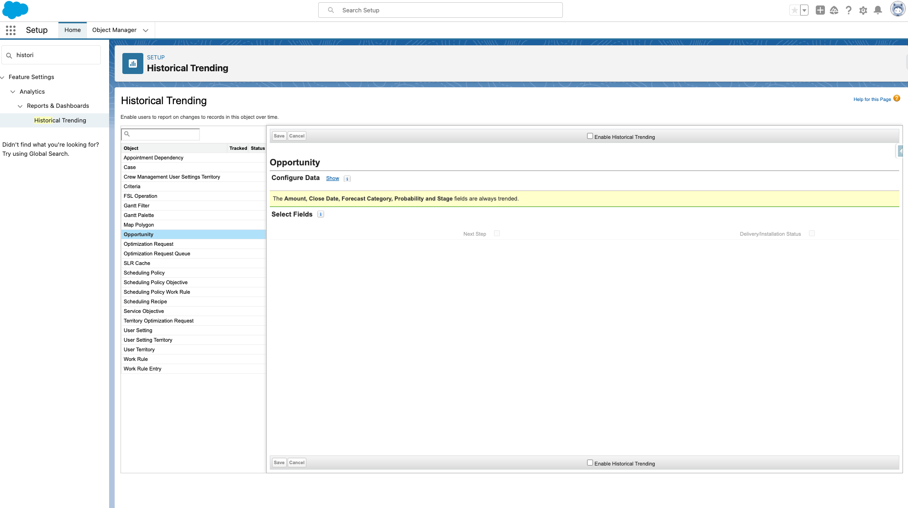

[Table of contents](../Documentation.md)
# Reporting

### What are the differents reports available in Salesforce
 - Tabular (no grouping)
 - Summary (grouped by rows)
 - Matrix (grouped by rows and columns)
 - Joined (report blocks that provide differents view of your data)

### Report over Aggregate Data
To display aggregated data, you can use a custom object to represent the incrementation.
If this solution isn't working, it's recommended to use "Tableau/CRM Analytics" and use a "Recipe".

### Display a Map
There is 3 options :
- AppExchange
- LWC with Apex Controller
- Tableau/CRM Analytics (Map is available OTB)

### Reporting over LDV objects
When reporting over LDV records, the timeout limit of 10 minutes need to be taken into consideration and as a best practice, use Tableau/CRM Analytics to report over LDV objects

## Historical Trend Reporting (Historical tracking reports)
Historical trend reporting uses a special custom report type designed to highlight changes between `five snapshot dates, such as five business days or five business weeks.` You can visually represent the data changes in charts and on dashboards.

Historical tracking must be enabled for each object (including the fields) that you want to track.

## Snapshots
Reporting snapshots allow you to load data from a custom report to a custom object on a regularly scheduled basis. Reporting snapshots enable you to work with report data as you would with other records in salesforce.com.

## Performances

### Improve Report Performances
1. Use Filters to remove unecessary data.
2. Remove un-used columns, etc.
3. Write Efficient Formula.
4. Optimize Sharing rules.
5. Hard Delete Reports (Records stay 1 month in the bin).
6. Run reports during Off-peaks hours.

### Limitations
- Reports can `only display 2k rows`.
- Time-out after 10 min.
- Historical Tracking limitations
    - Salesforce retains historical data for the `previous 3 months + the current month`.
    - Max 5M rows can be stored for historical data.
    - Historical Trend Reports can't be exported.