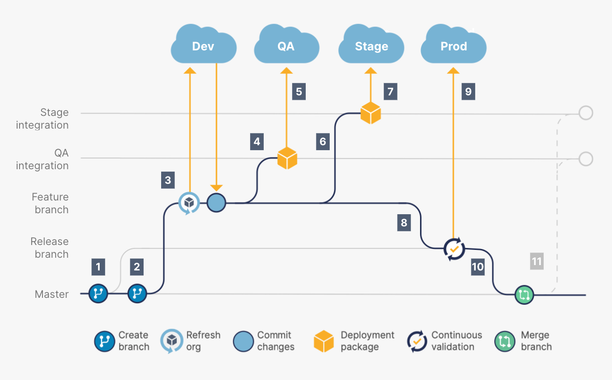

# Development Lifecycle

## Overview

The Development Lifecycle within the Salesforce ecosystem encompasses the process of creating, customizing, and deploying Salesforce solutions. This lifecycle involves several stages that ensure the successful delivery of high-quality and scalable solutions aligned with business objectives.

## Environment & Branching strategies

## Stages of the Development Lifecycle

### 1. **Discovery and Planning**

- **Objective:** Understand business requirements and define project scope.
- **Activities:**
  - Conduct stakeholder interviews to gather requirements.
  - Analyze and document business processes.
  - Define project goals, timelines, and resource requirements.

### 2. **Design**

- **Objective:** Create a blueprint for the Salesforce solution based on gathered requirements.
- **Activities:**
  - Develop a comprehensive solution design including data models, architecture, and integration strategies.
  - Design user interfaces and workflows.
  - Plan for scalability, security, and performance considerations.

### 3. **Development**

- **Objective:** Build and customize the Salesforce solution according to the design specifications.
- **Activities:**
  - Configure Salesforce using declarative tools (such as Process Builder, Flow Builder, etc.).
  - Develop custom functionalities using Apex, Visualforce, Lightning Web Components, or other programming languages.
  - Implement integrations with external systems.

### 4. **Testing**

- **Objective:** Ensure the solution meets functional and non-functional requirements and is free from defects.
- **Activities:**
  - Perform unit testing to validate individual components.
  - Conduct system testing to verify the overall functionality and integration.
  - Carry out performance, security, and user acceptance testing.

### 5. **Deployment**

- **Objective:** Deploy the solution from the development environment to production while minimizing disruptions.
- **Activities:**
  - Plan and execute deployment activities in a controlled manner.
  - Conduct post-deployment validation and user training.
  - Monitor and address any issues post-deployment.

### 6. **Maintenance and Support**

- **Objective:** Ensure the ongoing functionality, optimization, and support of the deployed solution.
- **Activities:**
  - Provide ongoing support to end-users and address any issues or enhancements.
  - Perform regular maintenance activities, including updates and patches.
  - Monitor system performance and scalability, making adjustments as needed.

## Agile and Iterative Approach

The Development Lifecycle can be executed using Agile methodologies, enabling iterative development cycles, frequent feedback, and adaptability to changing requirements. Agile fosters collaboration, flexibility, and faster time-to-market for Salesforce solutions.

## Conclusion

The Development Lifecycle for Salesforce solutions involves a series of well-defined stages from discovery to maintenance. Adopting a structured approach and leveraging Agile methodologies can significantly contribute to successful and efficient Salesforce implementations.

