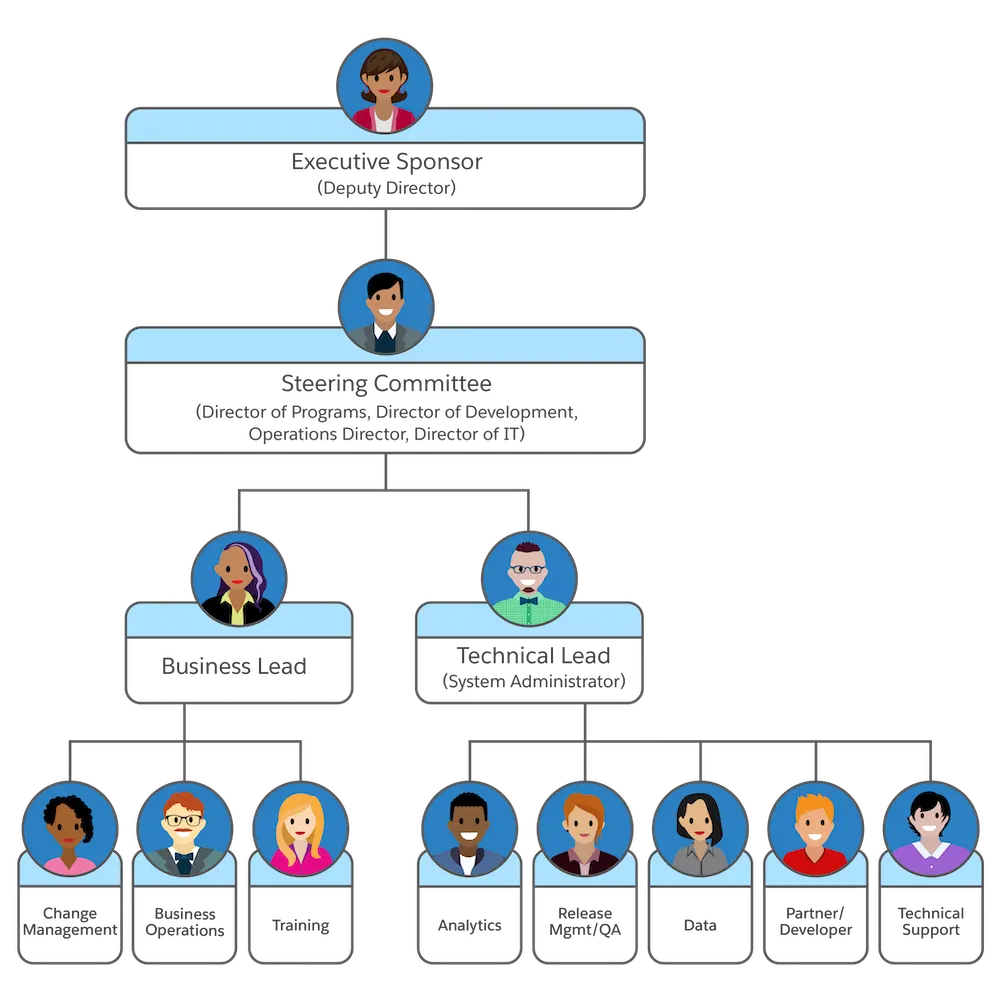
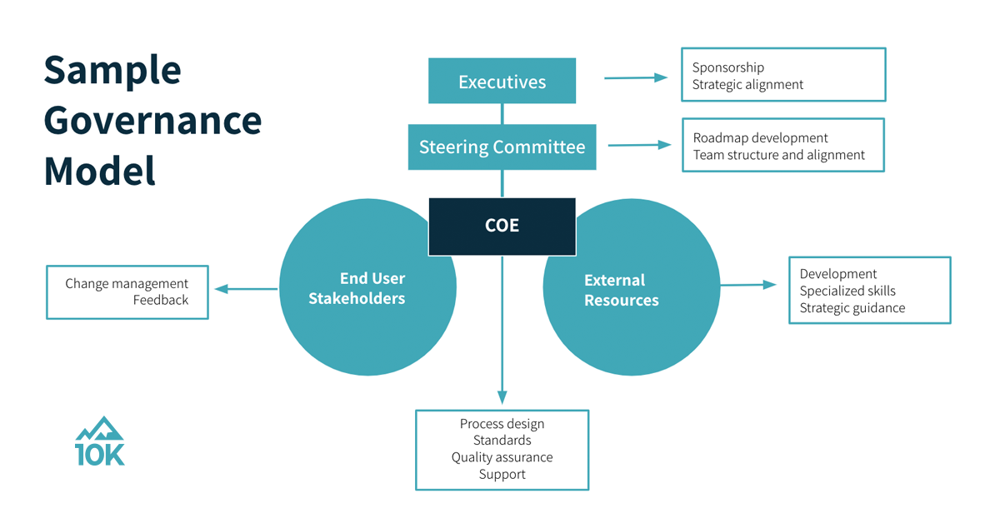

# Governance

## Overview

Governance within the Salesforce ecosystem is critical for ensuring alignment between business objectives, technical implementations, and overall project success. It involves various key entities and structures such as Center of Excellences (COEs), Architecture Review Board (ARB), Project Management Office (PMO), Program Manager, Steering Committee, and Sponsors.

## Organizational Structure

### Organizational Chart

The organizational structure for Salesforce implementations typically includes:

- **Executive Leadership**
  - CEO
  - CTO or IT Director
- **Governance Entities**
  - Center of Excellence (COE)
  - Architecture Review Board (ARB)
  - Project Management Office (PMO)
  - Steering Committee
- **Project Teams**
  - Program Manager
  - Development Team
  - Implementation Specialists
  - Quality Assurance

This hierarchical structure ensures clear lines of communication, decision-making, and support across different levels of the organization.

## Roles and Responsibilities

### Center of Excellence (COE)

The Center of Excellence is a dedicated team or group responsible for driving best practices, fostering innovation, and sharing expertise across different projects or areas within an organization. Their role includes:

- Developing and promoting standardized practices and guidelines.
- Providing guidance and support to project teams.
- Ensuring alignment with organizational objectives and strategies.
- Offering expertise and mentorship to enhance Salesforce solutions.

#### Strategies:
The CoE models can be built in 3 differents manner based on the situation.

* Centralized
* De-centralized
* Hybrid

#### CoE Models:

1. **Shared Services Centers** (`Most common CoE`)
   - Focus: Provide centralized services and resources shared across departments or business units.
   - Purpose: Streamline processes, reduce redundancies, and enhance efficiency by consolidating common functions like HR, IT support, or finance.

2. **Data Analytics and Business Intelligence Centers**
   - Focus: Data analysis, visualization, and insights generation.
   - Purpose: Empower decision-making, optimize processes, and drive strategies through advanced analytics and BI tools.

3. **Cybersecurity and Compliance Centers**
   - Focus: Safeguarding organizational data, systems, and networks.
   - Purpose: Establish security protocols, ensure compliance with regulations, and mitigate risks associated with cyber threats and data breaches.

4. **Customer Experience (CX) Centers**
   - Focus: Enhancing customer satisfaction and loyalty.
   - Purpose: Understand customer needs, improve interactions, and deliver exceptional experiences across all touchpoints.

5. **Change Management and Organizational Development Centers**
   - Focus: Managing organizational change effectively.
   - Purpose: Develop strategies, frameworks, and training programs to facilitate smooth transitions during changes.

### Specialized CoE Teams:

1. **Digital Transformation and Emerging Technologies Centers**
   - Focus: Driving digital transformation initiatives and adopting emerging technologies.
   - Purpose: Explore and implement innovative technologies like AI, IoT, and blockchain to propel organizational growth.

### Architecture Review Board (ARB)

The Architecture Review Board oversees the architectural aspects of Salesforce implementations. Their responsibilities include:

- Reviewing proposed solutions for compliance with established architectural principles and standards.
- Evaluating design choices, scalability, security, and performance implications.
- Providing recommendations and approvals for architectural changes or additions.
- Ensuring adherence to best practices and maintaining a coherent architectural landscape.

### Project Management Office (PMO)

The Project Management Office is responsible for maintaining standards and governance across all projects within an organization. Their key functions include:

- Establishing project management methodologies, processes, and tools.
- Monitoring project progress, risks, and resource allocation.
- Ensuring compliance with established project governance and quality standards.
- Providing support and guidance to project teams to achieve successful project outcomes.

### Program Manager

The Program Manager oversees multiple interconnected projects or initiatives within a program. Their role involves:

- Aligning project objectives with strategic goals.
- Managing interdependencies between projects.
- Providing leadership, guidance, and support to project managers.
- Ensuring overall program success by coordinating resources and efforts effectively.

### Steering Committee and Sponsors

The Steering Committee and Sponsors play a crucial role in providing direction, support, and resources for Salesforce projects. Their responsibilities include:

- Setting strategic direction and priorities for Salesforce initiatives.
- Providing funding, resources, and executive support for projects.
- Reviewing and approving major project milestones and deliverables.
- Resolving escalated issues and ensuring alignment with organizational goals.

## Data Management & Data Governance

In the simplest terms, data governance establishes policies and procedures around data, while data management enacts those policies and procedures to compile and use that data for decision-making.

## Project Management Frameworks

### Agile

**Suitability:** Agile methodologies, such as Scrum or Kanban, are well-suited for Salesforce projects that require frequent iterations, adaptability to changing requirements, and continuous feedback. It is beneficial when:

- **Requirements are Dynamic:** When project requirements are likely to evolve or are not fully known upfront.
- **Client Collaboration:** Projects where client involvement and feedback are crucial throughout the development process.
- **Faster Time-to-Market:** Situations demanding quicker deliveries and incremental releases.

### Waterfall

**Suitability:** Waterfall methodology is more appropriate for Salesforce projects with well-defined and stable requirements. It is beneficial when:

- **Clear Requirements:** Projects where requirements are well-understood and unlikely to change significantly.
- **Sequential Approach:** When a step-by-step progression through distinct phases (requirements, design, development, testing, deployment) is necessary.
- **Documentation Emphasis:** Situations requiring extensive documentation and a structured approach.

### Hybrid

**Suitability:** Hybrid approaches combine elements of both Agile and Waterfall methodologies. They are suitable for Salesforce projects where:

- **Varied Project Phases:** Projects that have different components with varying levels of certainty in requirements.
- **Flexibility and Structure:** Need for both adaptability to change and a structured framework for certain phases.
- **Risk Mitigation:** Allows for iterative development while ensuring critical milestones and deliverables are met.

## Importance of Governance Entities

Each governance entity plays a pivotal role in ensuring the success of Salesforce implementations:

- **Alignment:** Ensures alignment of technical solutions with business objectives and strategies.
- **Quality Assurance:** Maintains standards, best practices, and compliance throughout the project lifecycle.
- **Risk Mitigation:** Identifies and addresses risks early to minimize potential project disruptions.
- **Executive Support:** Secures necessary resources, funding, and executive buy-in for successful project execution.

Effective governance fosters collaboration, reduces risks, and enhances the overall success rate of Salesforce projects.

## Conclusion

Effective governance, coupled with an appropriate project management framework, ensures successful Salesforce implementations. Understanding the organizational structure and selecting the right project management methodology based on project requirements are crucial for achieving desired outcomes.

