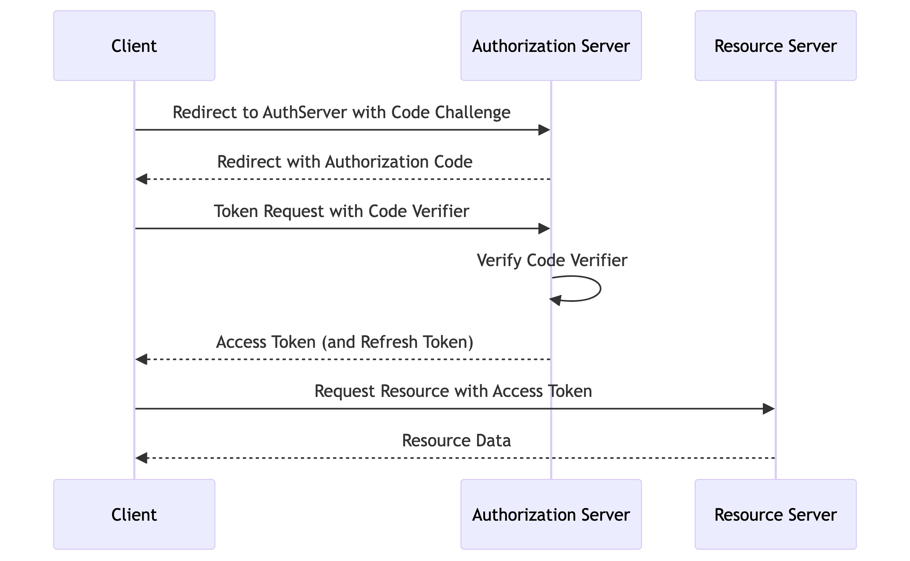

[Table of Contents](../Documentation.md)

# OAuth Flows

## List of Flows

- Mobile & Browser
    - Web Server Flow
    - User Agent Flow
- Server
    - JWT Bearer Flow
    - SAML Bearer Flow
    - Client Credential Flow
    - Refresh Token Flow
    - Username and Password Flow
- IOT
    - Device Flow (Special)
    - Asset Token Flow (Special)

## SAML vs OpenId Connect

SAML is XML-based and is the most used SSO protocol. OpenID Connect is an extension of OAuth 2.0 with data structure in JSON. It's mainly used by social media applications.

## Terms & Definitions

### Authorization Code Request

The authorization code grant is used when an application exchanges an authorization code for an access token. After the user returns to the application via the redirect URL, the application will get the authorization code from the URL and use it to request an access token.

# SSO Flow

## SAML Flows

### IDP initiated Flow

In the IDP initiated Flow, we assume that the user is already logged in the IDP.


### SP initiated Flow


## OpenId Connect Flows


# GENERAL OAUTH 2.0 FLOWS

## Mobile & Browser

### Web Server Flow

The Web Server Flow is a secure and widely-used method for web applications to obtain access tokens. By using an authorization code, it ensures that the client securely exchanges the code for an access token, reducing the risk of token interception. This flow is particularly useful for web applications that can securely store client secrets.


#### Web Server Flow with PKCE
PKCE (Proof Key for Code Exchange) is an extension to the OAuth 2.0 authorization code flow designed to improve the security of public clients (e.g., single-page applications, mobile apps) by mitigating the risk of authorization code interception attacks. It is particularly useful for web server integrations where the client is a web application running on a server.

##### 1. Code Verifier and Code Challenge

- **Code Verifier**:
  - A high-entropy cryptographic random string (e.g., 43-128 characters).

- **Code Challenge**:
  - Derived from the code verifier using a transformation method (e.g., SHA-256).

```plaintext
code_challenge = BASE64URL-ENCODE(SHA256(ASCII(code_verifier)))
```

##### 2. Authorization Request

The client directs the user to the authorization server with the following parameters:

- `response_type=code`
- `client_id=YOUR_CLIENT_ID`
- `redirect_uri=YOUR_REDIRECT_URI`
- `code_challenge=CODE_CHALLENGE`
- `code_challenge_method=S256`

##### 3. Token Request

The client exchanges the authorization code for an access token by including the following parameters:

- `grant_type=authorization_code`
- `client_id=YOUR_CLIENT_ID`
- `code=AUTHORIZATION_CODE`
- `redirect_uri=YOUR_REDIRECT_URI`
- `code_verifier=CODE_VERIFIER`

##### Webserver Flow with PKCE


### User Agent Flow

This is a deprecated flow. It's recommended to use the "Web Server Flow" with PKCE (Proof Key for Code Exchange)


## Servers

### JWT Bearer Flow

JSON Web Tokens (JWT) are a compact, URL-safe means of representing claims to be transferred between two parties. They are commonly used for authorization and information exchange.

JWT can be enriched by including extra information such as user information, context, etc

#### Example JWT Structure
**Header**:
```json
{
  "alg": "RS256",
  "typ": "JWT"
}
```

**Payload**:
```json
{
  "iss": "Client_ID from Step 2.1.1",
  "sub": "UserName",
  "aud": "https://login.salesforce.com",
  "exp": "CurrentTimestamp + 2 minutes"
}
```

**Signature**:
```plaintext
HMACSHA256(
  base64UrlEncode(header) + "." +
  base64UrlEncode(payload),
  Private Key
)
```

#### Steps to Create and Test the JWT Token

1. **Create the Header**:
   - Define the algorithm (`RS256`) and token type (`JWT`).

2. **Create the Payload**:
   - Include the `iss`, `sub`, `aud`, and `exp` claims.
   - Ensure the `exp` claim is set to the current timestamp plus 2 minutes. Use [unixtimestamp.com](https://www.unixtimestamp.com/) to get the current Unix timestamp.

3. **Generate the Signature**:
   - Encode the header and payload using Base64 URL encoding.
   - Sign the encoded header and payload using the private key with the `HMACSHA256` algorithm.

4. **Combine the Components**:
   - Concatenate the Base64 URL encoded header, payload, and the signature with periods (`.`) to form the JWT.

5. **Test the JWT**:
   - Use [jwt.io](https://jwt.io/) to decode and verify the JWT.
   - Input your header, payload, and private key to validate the token.

#### JWT Bearer Flow


# Layered Flows (OAuth 2.0 with SAML or OpenId Connect)

### OAuth 2.0 User Agent with SAML


### OAuth 2.0 Web Server with SAML


### OAuth 2.0 User Agent with Social Sign On (OpenId Connect)

In this case, Salesforce represents the "Authorization Server" and the "Resource Server". It can be simplified that way to make it easier to understand.


