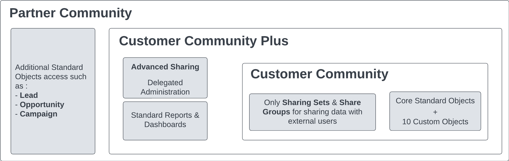

# Experience Cloud

## External User Licenses

It's forbidden to use Experience Cloud Licenses for internal users. Different licenses and their descriptions include:

| License | Description |
|---------|-------------|
| External App |The External App license is designed for external users who need access to custom applications built on the Salesforce platform. These users can interact with Salesforce data via custom apps, but the license limits access to standard Salesforce objects. This is suitable for organizations that want to extend custom functionality to external users without granting full Salesforce access |
| Customer Community | The Customer Community license is intended for external users who need access to Salesforce for activities such as case management, viewing knowledge articles, and engaging with a company’s service and support team. This license is typically used for B2C interactions, where customers need limited access to Salesforce resources to find solutions to their problems, engage with support, or view their account information.| 
| Customer Community Plus | The Customer Community Plus license provides more advanced access compared to the Customer Community license. It is designed for external users, such as customers or partners, who need additional capabilities like access to reports, dashboards, and the ability to collaborate more extensively with internal users. This license is often used in B2B scenarios where customers need deeper engagement and collaboration capabilities.| 
| Partner Community | The Partner Community license is tailored for external partners who need access to Salesforce to manage leads, opportunities, and campaigns, as well as collaborate on deals. This license includes access to additional objects and features that support channel sales and partner relationship management, making it ideal for organizations that work closely with a network of partners. |
| Channel | The Channel license (often referred to as the "Channel Account" license) is used by channel partners who manage reseller or distributor relationships. It enables users to access Salesforce to manage their accounts, leads, opportunities, and other sales-related activities. This license is designed for complex partner relationships where partners need deep access to Salesforce functionality to support their sales and distribution efforts. |

## Salesforce Features, Capability, and Custom Objects

A comparison of features across different community licenses:

| Feature | Customer Community | Customer Community Plus | Partner Community | External App |
|---------|--------------------|-------------------------|-------------------|--------------|
| Accounts|  Read & Edit| ✅ | ✅ |Read & Edit|
| Contacts|  ✅| ✅ | ✅ | ✅|
| Assets|  ✅| ✅ | ✅ | ✅|
| Contracts | ✅| ✅ | ✅ |  ✅|
| Cases| ✅| ✅ | ✅ |❌ |
| Knowledge | ✅| ✅ | ✅ |  ✅|
| Order | ✅| ✅ | ✅ |  ✅|
| Product| Read Only| Read Only | Read Only | Read Only|
| Pricebook| Read Only| Read Only| Read Only| Read Only | 
| Opportunities |❌|❌| ✅  |❌
| Leads|❌|❌| ✅ | ❌|
| Tasks| Read Only | ✅ | ✅| ✅ |
| Calendar & Events|Read Only|✅| ✅ | ✅|
| Service Contract|  ❌| ✅ | ✅ | ✅|
| Work Order| ✅| ✅ | ✅ | ✅|
| Custom Objects| 10| 10| 10 | 100|
| Send Email| ❌| ✅| ✅ |❌|
| Sharing Sets| ✅| ✅ | ✅ | ✅|
| Account Teams |❌| ❌| ✅ | ❌|
| Advanced Sharing Rules |❌|✅| ✅ |  ✅|
| Omnichannel |❌|❌| ❌| ❌| ❌ |
| Reports & Dashboards |❌| Read Only| ✅ | ✅ | ❌|
| Territory Management|❌|❌|✅|✅|
| Workflow Approvals|✅|✅|✅|❌|
| Extra Data Storage | 0 | 2MB/1MB | 5MB/1MB | 10MB |
| Extra File Storage | 0 | 2MB/1MB | 5MB/1MB | 10MB |
| API Calls per Day |  0 | 200/10 | 200/10 | 200/400 |

[More details](https://help.salesforce.com/s/articleView?id=sf.users_license_types_communities.htm&type=5)

## Templates

Salesforce provides base templates for Experience Cloud, including Help Center (Articles), Customer Service (Self-service), Customer Account Portal, and Partner Central (Sales processes). Users can also create custom templates using technologies like LWR (Lightning Web Runtime) and Salesforce Tabs + Visualforce.

## Experience Cloud Sites Usage Allocation

Usage of Experience Cloud sites is regulated by daily, monthly, and yearly allocations. Add-ons can be purchased for extended usage. Allocations differ across editions.

| EDITION | BANDWIDTH ALLOCATION (PER ROLLING 24-HOUR PERIOD PER COMMUNITY) | SERVICE REQUEST TIME (PER ROLLING 24-HOUR PERIOD PER SITE) | MAXIMUM PAGE VIEWS |
|--|--|--|---|
| Enterprise Edition  | 40 GB | 60h| 500k|
| Unlimited & Performance Edition   | 40 GB for production| 60 hours for production| 1M|

## Personal Contact Information Visibility

Users can control the visibility of their personal contact information based on categories like "Employees," "External," and "Public." This control can be exercised via the UI or API.

## Account Role Optimization (High Volume Site)

For high-volume sites, Account Role Optimization (ARO) helps optimize performance by reducing external roles, especially with a large volume of business accounts having a single Experience Cloud user.

[More Information](https://www.learnexperiencecloud.com/article/Configure-Account-Role-Optimization-to-Help-You-Scale-Your-Experience-Cloud-Users)

## External Roles 

Information about external roles and allocations:

| Role or Community User Allocations | Allocation | Details |
|------------------------------------|------------|---------|
| Total roles for users with licenses that require external users to be associated with roles | 50k | This allocation includes all roles associated with users who hold licenses requiring external users to be associated with roles, such as Customer Community Plus and Partner Community licenses. For more roles, contact Salesforce Customer Support. |
| Maximum person account site users that a Salesforce user can own | 50k | Contact Salesforce Customer Support to increase this allocation. |

The default allocation for roles is 50k but can be increased with a Salesforce case (up to 500k with analysis and approval).

## Content Management System (CMS)

Salesforce CMS is an ideal tool for managing and distributing content across various channels from within Salesforce.  
Content can be shared via:

- LWC Components (used in Experience Cloud, Commerce Cloud)
- REST API (Connect API)

If you need to integrate an external CMS with Experience Cloud, **CMS Connect** is the solution. It allows you to import content from platforms like WordPress and AEM, ensuring a consistent user experience by synchronizing the header and footer.