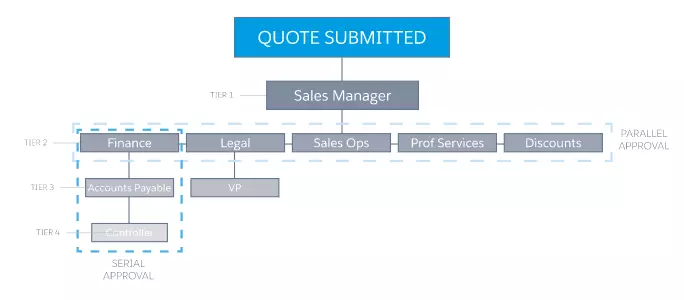
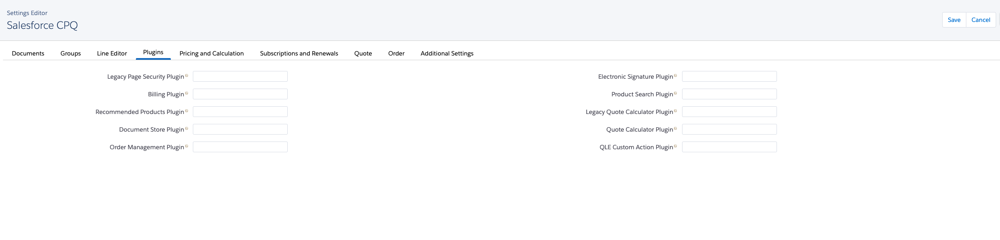

# Salesforce CPQ
Package that help enabling advanced quoting and build customisable solution.
## Licenses

The licensing model is based on `permission set license`.\
When a permission set is assignd to the user, the permission set license is consummed.

For External users, there is extra licenses:
- `CPQ for Customer Community`
- `CPQ for Partner Community`

|Features | `CPQ` | `CPQ+` | CPQ & Billing Growth | CPQ+ with Billing|
|--|--|--|--|--|
|Configuration, Pricing, and Quoting | ✅|✅|✅|✅
|Enhanced Product Catalog and Price Book | ✅|✅|✅|✅
|Advanced Approvals and Order Management |❌|✅|✅|✅
|Usage-Based Pricing |❌|✅|✅|✅
|Invoicing and Revenue Schedules |❌|❌|✅|✅
|Complex Revenue Reporting |❌|❌|❌|✅
|Automated Payments and Allocations |❌|❌|❌|✅

## Data Model
### Product Bundle

### Pricing Model

### Order Model

## Features
1. Configure Products
2. Advanced Pricing Model
3. Advanced Quoting (Quote record & PDF document)
4. Advanced Approval Processes

## Configure Products
Products can be grouped into bundle to sale package or link "Peripherals" product to discuss potential "up-sale" or optional purchases with the customer.

### Product Rules
There is 4 products rules :
| Rule Type | Description|
|--|--|
| Validation Rules | Confirm that a quote's product combinations or quote line field values match predetermined conditions. |
| Selection Rules | Automatically add, remove, hide, enable, or disable options in a bundle. |
| Filter Rules | Prefilter the products that are available to add to a bundle.|
| Alert Rules| Guide and inform through messages during configuration or pricing. |

## Advanced Pricing Model

CPQ is following a `waterfall pricing model` (from top to bottom).

CPQ support multiple method to define the price:
- Block Price (Volume)
- Percent of Total
- Cost + Markup Price
- Option Price (For bundle, to make an element differ)
- Contract Price
- Manual Price

A non exhaustive list of discounts :
- Optional Discount.
- Manual Discount.
- Volume Based Discount.
- Partner/Distributor Discount.

## Quoting documents
CPQ contain an advanced tool to generate pdf and allow the insertion of "Dynamic" content in the pdf :\
1. Quote Terms
2. Pages
3. Sections

### Contracts & Renewal
Some business model as using "Subscription-based" model.
When an opportunity is "closed/won", a contract is created to represent the aggreement. (Custom Flow needed)

Salesforce CPQ will automatically create a renewal opportunity when the contract end-data is approaching to simply the selling process.\
This process is helping to keep the forecast accurate and up-to-date.

## Advanced Approval Processes
Salesforce has standard approval functionality, which meets a lot of common use cases. But for businesses with more involved approval workflows, Salesforce CPQ offers advanced approvals (AA).

This figure demonstrates an approval path with multiple tiers as well as serial and parallel approvers. For some systems, something like this can be complex to implement. Not for AA.

### Key Features of Advanced Approvals
| Feature | Description |
|--|--|
| Smart Approvals | If an approver or approval group has already approved a quote and it gets rejected in a higher tier, the same approver or approval group isn't required to reapprove when the quote is resubmitted. Salesforce CPQ remembers the sequence. |
| Requiring Approvals  | Reps have complete visibility into what approvals they'll need to obtain as they work on their quotes, so there are no surprises when they submit for approval. |
| Delegated Approvers | Used for assigning an approver to take over for someone while they are out of the office.|
| Replacing Approvers | If a certain approver is no longer required to approve quotes, they can be replaced with clicks. This eliminates the need to delve into every single approval process the old approver was a part of to manually replace them. |

## Advanced Order Management
With AOM, you can split orders to create multiple orders from a single quote, letting you send products to multiple locations or at different times.
### Key Features of Advanced Order Management

| Feature | Description |
|--|--|
| Fulfill Orders Faster| Seamlessly generate orders from quotes to quickly get products and services delivered to your customers. |
| Flexible for Evolving Customer Needs | Split quotes into multiple orders, manage future dated orders, and modify with point-and-click. |
| 360-Degree View of the Customer | Quickly generate contracts with all contract term, pricing, asset, and subscription details. |
| Connect to Back Office | Sync order details to ERP for order fulfillment.|

## Billing
Salesforce Billing is an add-on package that inherits key records and information from Salesforce CPQ. After a sales rep finalizes a quote and orders it within Salesforce CPQ, Salesforce Billing picks up the order record for invoicing, payment, and revenue recognition.

### Billing Data Model

## Plugin configuration with external tools
CPQ apex architecture allow modification to be easily handled by building Apex interfaces for specifics modules such as (Recommendation, E-Signature, ERP integration, etc)

 

