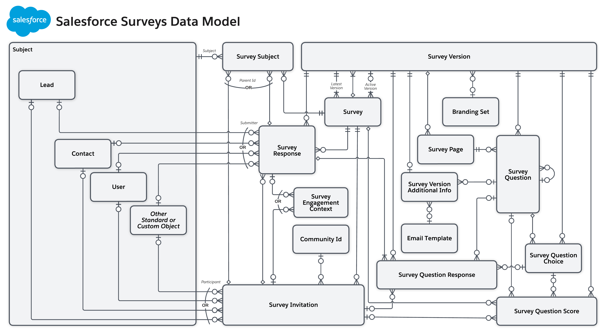

[Table of Contents](../Documentation.md)

# Salesforce Feedback Management

Salesforce Feedback Management is an add-on that provides advanced feedback management capabilities to Salesforce.

With the Feedback Management app:
- **Custom Surveys**: Design custom surveyswith various question types that can be send to customer;
- **Distribution Channels**: Send surveys via email, web, mobile, social media, and more (Omnichannel).
- **Automation and Triggers**: Schedule surveys or trigger them based on events.
- **Multi-Channel Feedback Consolidation**: Centralize feedback from different sources.
- **Real-Time Reporting and Dashboards**: Analyze feedback data with customizable reports and dashboards.
- **Integration with CRM Data**: Correlate feedback with customer profiles, purchase history, etc.
- **Closed-Loop Feedback Management**: Follow up with customers based on their feedback.
- **Customization and Extensibility**: Tailor feedback management processes to specific needs.

## Licenses

Salesforce Feedback Management is based on "Consumption" (No User license) of survey responses.

Survey Response Pack can be bought to increase the amount of "Received Response" (1K / pack)

| Features | Feedback Management - `STARTER` | Feedback Management - `Growth` |
|----------|---------------------------------------|-----------------------------|
| Receive Response | `100k` | Unlimited |
| Gath post chat survey   | ❌ (Only for Experience Cloud)  | ✅ |
| Embed survey in experience Cloud   | ✅  | ✅ |
| Embed survey in website   | ❌  | ✅ |
| Track Survey sent accross User Lifecycle | ❌  | ✅ |
| Cancellation Return       | ❌  | ✅ |

# Documentation

## Data Model

## Distribute Surveys
Generate different types of survey invitations and distribute them in a way that best suits your participants' needs. You can generate individual invitations, send invitations by email, or automate the distribution process.
- Email
- Process Builder, Flow
- **Digital Engagement Channels** (SMS, Whatsapp, Facebook)
- QR Code
- **Marketing Campaign** (Using Marketing Cloud - Journey Builder)
- UnAuthenicated Users (Guest Users)

## Generative AI Surveys

Use **generative AI** to quickly create and translate surveys tailored for diverse needs. Specify key survey parameters, review the auto-generated questions, and add approved questions in the survey builder. 
Use generative AI for accurate translation of entire surveys or specific parts, enabling feedback collection from a global audience.

Surveys can be translated using **Generative AI** to create surveys in differents languages.

## Scheduled Reminders

Create automated email reminders to keep users updated about important occasions. Send recurring or one-time reminders to keep recipients informed and ready for completed occurrences or actions.

## Sentiments Insights

Get insight into the sentiment behind text-based survey responses. Create an AWS account and enable Sentiment Insights. Then create a data map and then use a Flow action or template to analyze the sentiment that underlies survey responses.

Insights can also proccessed usign NLP technologies (AWS)

## Links

[Documentation](https://help.salesforce.com/s/articleView?id=sf.concept_salesforce_surveys.htm&type=5)