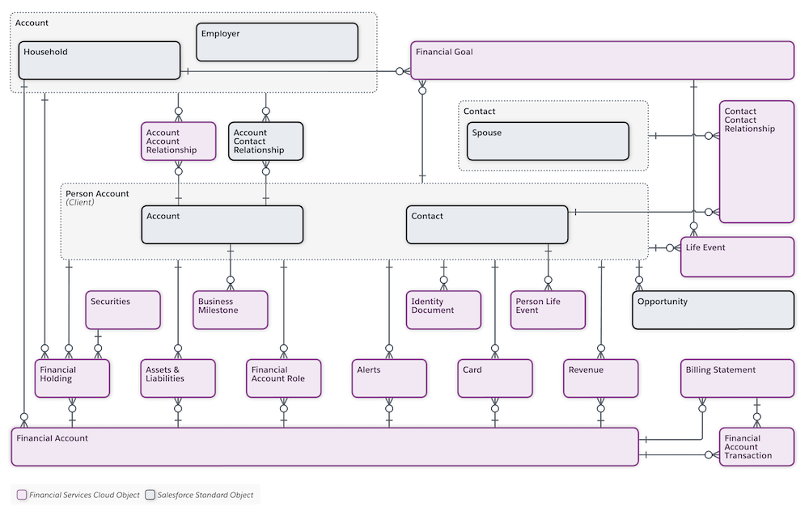
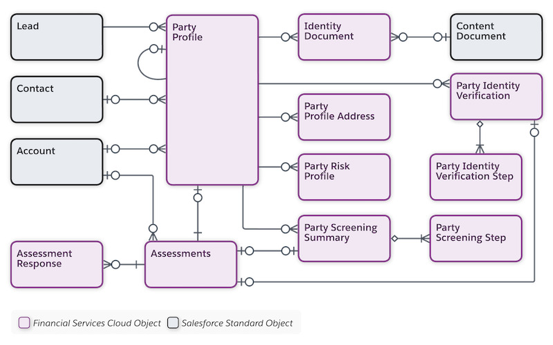
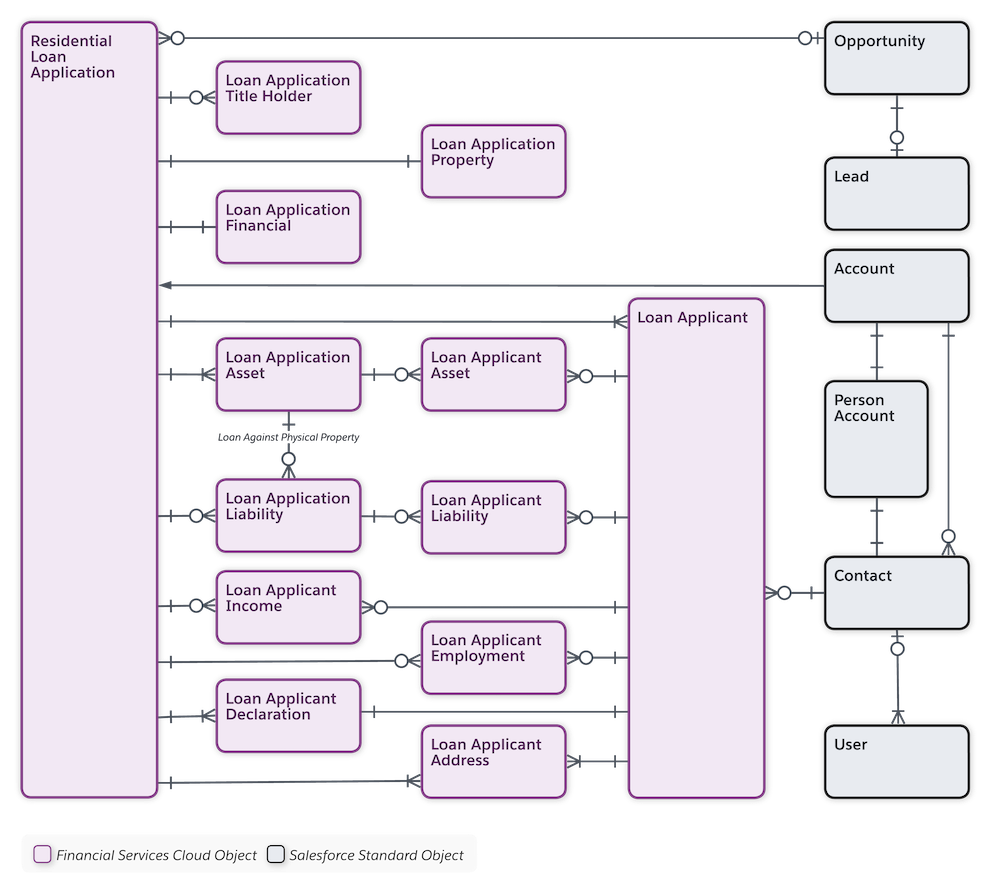

[Table of Contents](../Documentation.md)

# Salesforce Financial Service Cloud

Salesforce Financial Service Cloud is an add-on that enables financial services institutions to build trust by unifying the customer experience across channels, geographies, and lines of business—both commercial and consumer.

**More details to be added.**

## Licenses

**More details to be added.**

# Documentation

## Data Model
### Core Data Model

### Client Overview

### Insurance Model

### Loan Application

## Links

[Documentation](https://help.salesforce.com/s/articleView?id=sf.fsc_admin.htm&type=5)
