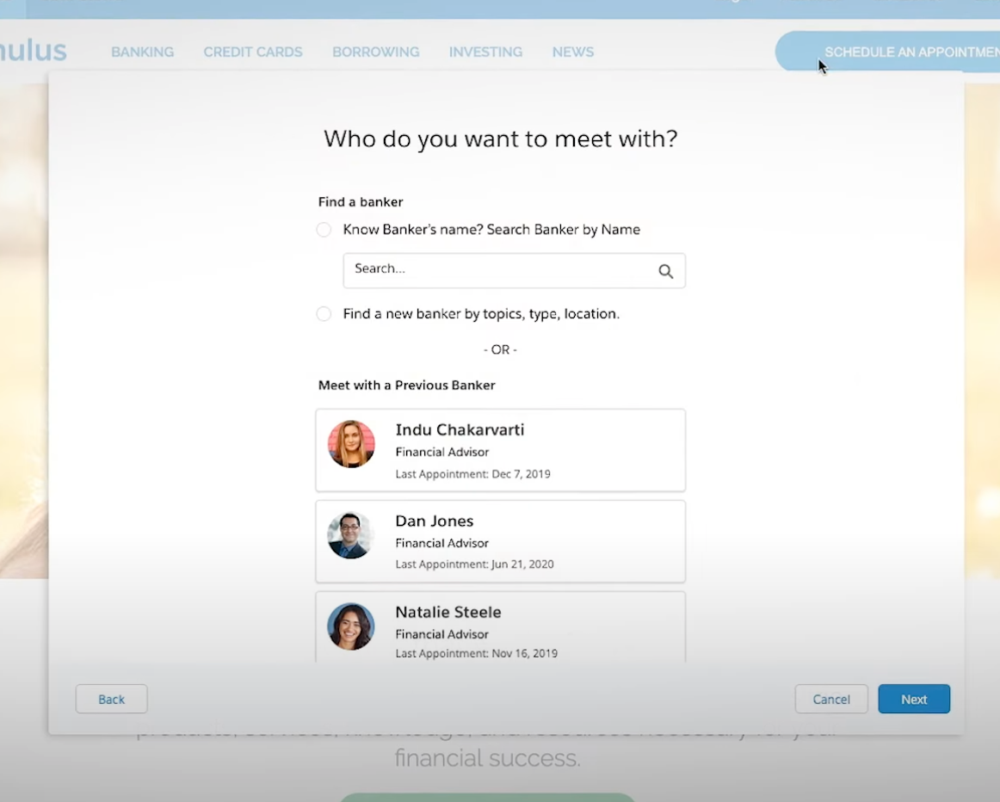
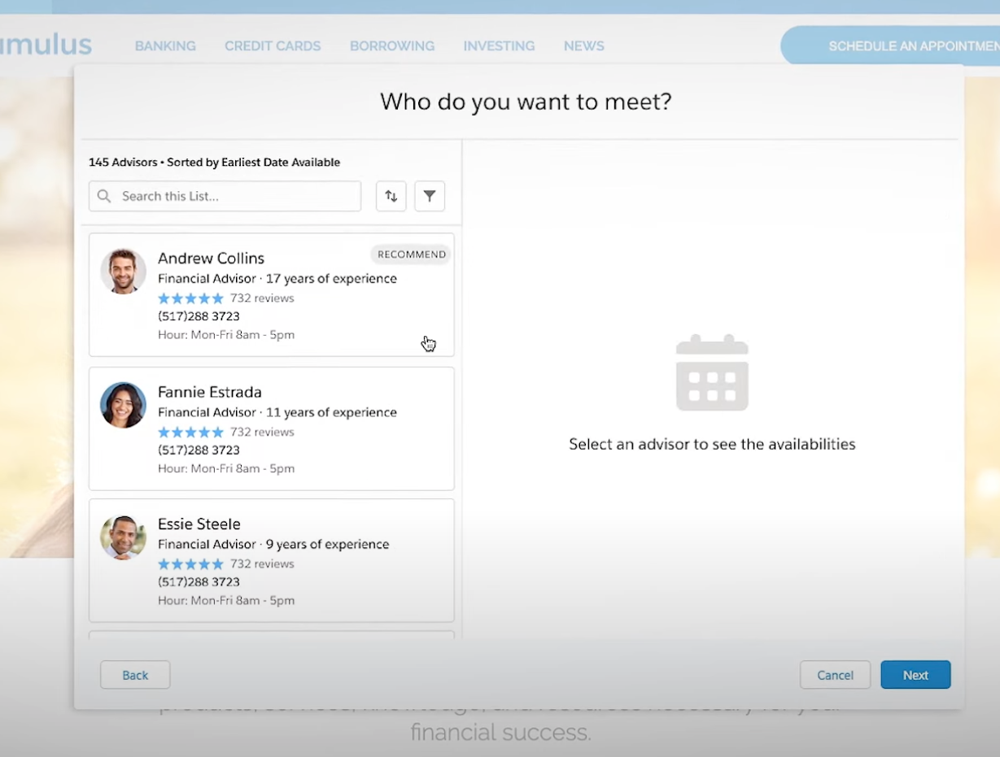
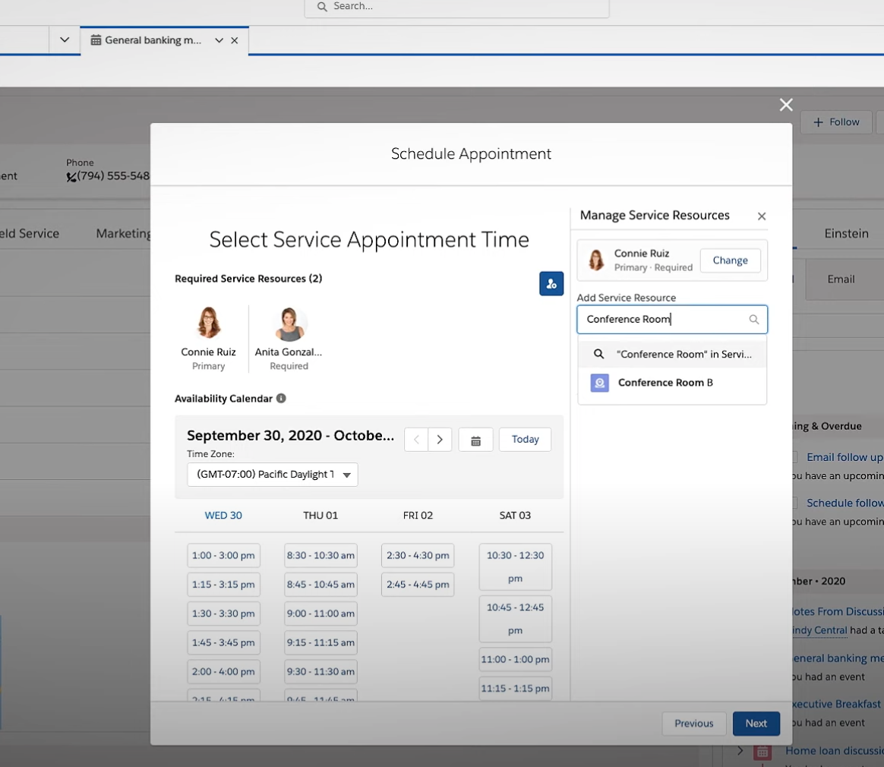
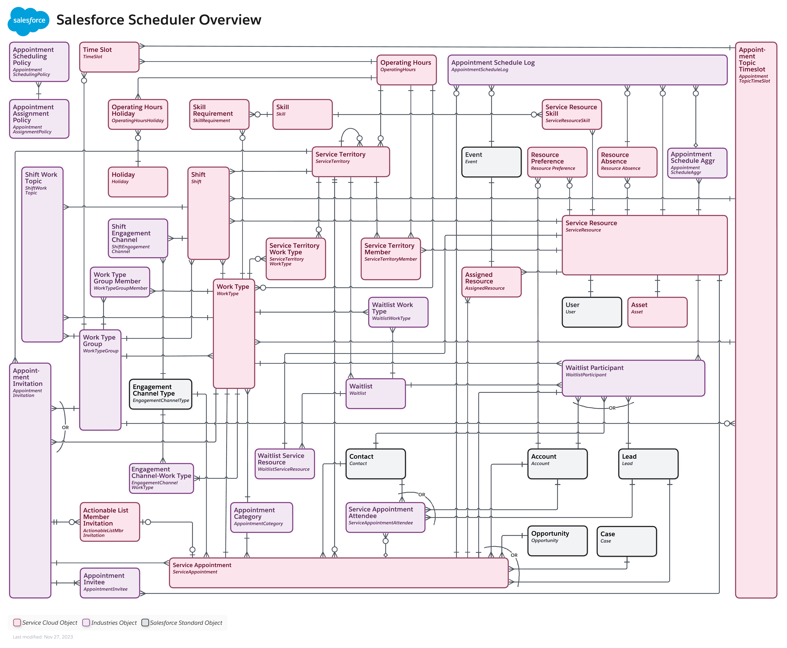

[Table of Contents](../Documentation.md)

# Salesforce Scheduler

Salesforce Scheduler (formerly known as Lightning Scheduler) gives you the tools and developer resources you need to simplify appointment scheduling in Salesforce. \
Create a personalized experience by scheduling customer appointments—in person, or by phone or video—with the right person at the right place and time.

With Salesforce Scheduler developer resources, it’s easy to build seamless appointment scheduling applications.\
These resources include `REST APIs, Connect REST APIs, Salesforce Platform Events, and Apex classes.` \
Appointment scheduling involves numerous resources such as appointment attendees, appointment locations, appointment topics, appointment timings, appointment duration, and so on. \
With Salesforce Scheduler, you get the tools that you can use to manage these resources.

Before using the Scheduler resources, you must configure Scheduler with the following items:

- Create service resources that represent your appointment attendees, and add details about their areas of expertise (skills), location, and availability.
- Set up `service territories` that represent the branch or office locations where your appointment attendees operate from or meet customers.
- Create work type groups that represent appointment topics such as home loan or investment.
- Create work types that represent appointment templates that link appointment topics with particular locations and define key parameters such as appointment duration, preparation and wrap-up buffers, and availability timings.
- Schedule customer appointments with defined topics, attendees, duration, and location.

## Licenses

The licensing model is based on permission set licenses. When a permission set is assigned to the user, the permission set license is consumed.

## Documentation

### External Calendar Integration
Salesforce Scheduler provides developer resources that you can use to write appointments directly to, and read events from, external calendars.

### Components
Salesforce Scheduler provide components that can be used in Salesforce and Experience Cloud platforms. It's also possible to use `Lightning out` to display the components on an external website.

### Screenshots
#### Appointment Booking (Experience Cloud & Lightning Out)

#### Appointment Editing (Salesforce Platform)

### Data Model
#### Core Data Model

#### Including Industry Cloud

## Links

[Official Documentation](https://developer.salesforce.com/docs/atlas.en-us.salesforce_scheduler_developer_guide.meta/salesforce_scheduler_developer_guide/salesforce_scheduler_intro.htm)
[Demo Video](https://www.youtube.com/watch?v=n_twBUxeUaI&ab_channel=Salesforce)

