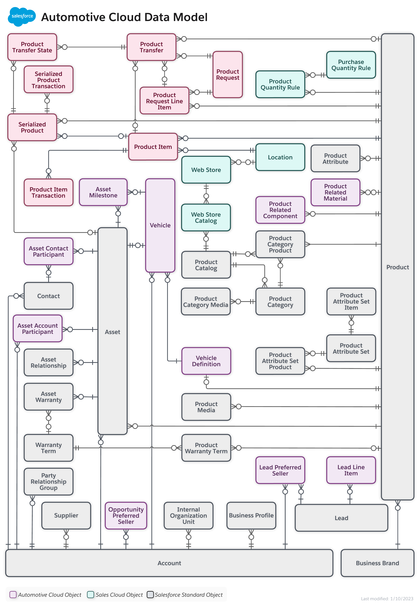
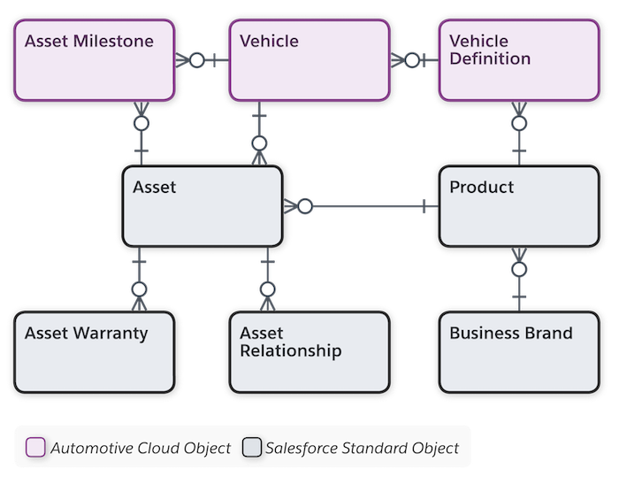

[Table of Contents](../Documentation.md)

# Salesforce Automotive Cloud

Automotive Cloud is built on Sales Cloud and Service Cloud and enables manufacturers and dealers to effectively manage the key touch points in the lifecycle of customers and vehicles. The data model and workflows are based on industry-wide best practices that reduce the time you spend on routine, repeated tasks. 

You can focus on engaging with customers and drive brand loyalty by designing actionable experiences around the important mobility moments. 

Automotive Cloud transforms the dealer and stakeholder experience and equips you to deliver the personalized, proactive service that your clients expect.

**More details to be added.**

## Licenses

**More details to be added.**

# Documentation

## Data Model
### Core Data Model

### Vehicle Data Model

- **Business Brand**
stores information about brands of products that help with customer engagement. Multiple products can be related to one business brand.
- **Product**
stores information about each item in the product portfolio, such as a vehicle model or a part type. Use automotive-specific fields on Product to define parts or vehicle models.
- **Asset**
stores information about a `built or sold physical asset instance, such as a vehicle or a part.` An asset can have multiple related child assets.
- **Asset Milestone**
stores information about key events or moments in an asset’s lifecycle, such as the milestone type, milestone location, milestone date, and stage. Each asset can have multiple related asset milestones.
- **Asset Warranty**
stores information about warranties related to an asset, such as the warranty type, warranty date, and details of parts and labor covered. Each asset can have multiple related asset warranties.
- **Asset Relationships**
stores information about replacement, upgrade, or cross-grade assets related to an asset. Each asset can have multiple asset relationships.
- **Vehicle Definition**
stores information about a typical vehicle model, such as stylistic specifications, battery and engine specifications, and fuel economy specifications. Each vehicle definition has one related Product record.
- **Vehicle**
stores information about a `specific vehicle instance, such as registration details, vehicle identification number, and odometer readings. Each vehicle has one related Asset record.`

## Links

[Documentation](https://help.salesforce.com/s/articleView?id=sf.auto_cloud.htm&type=5)
