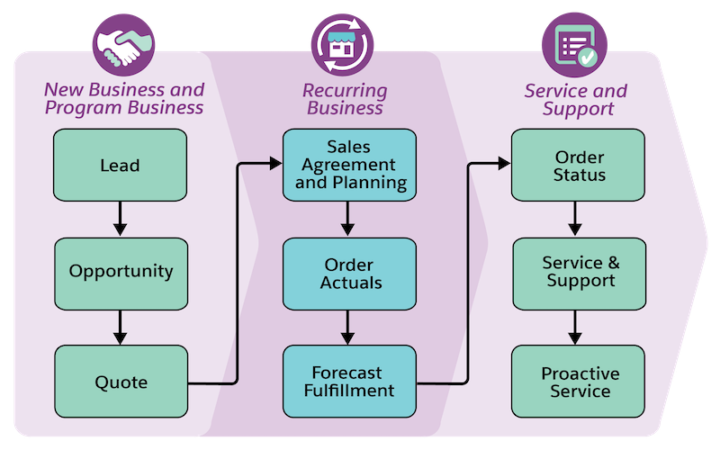
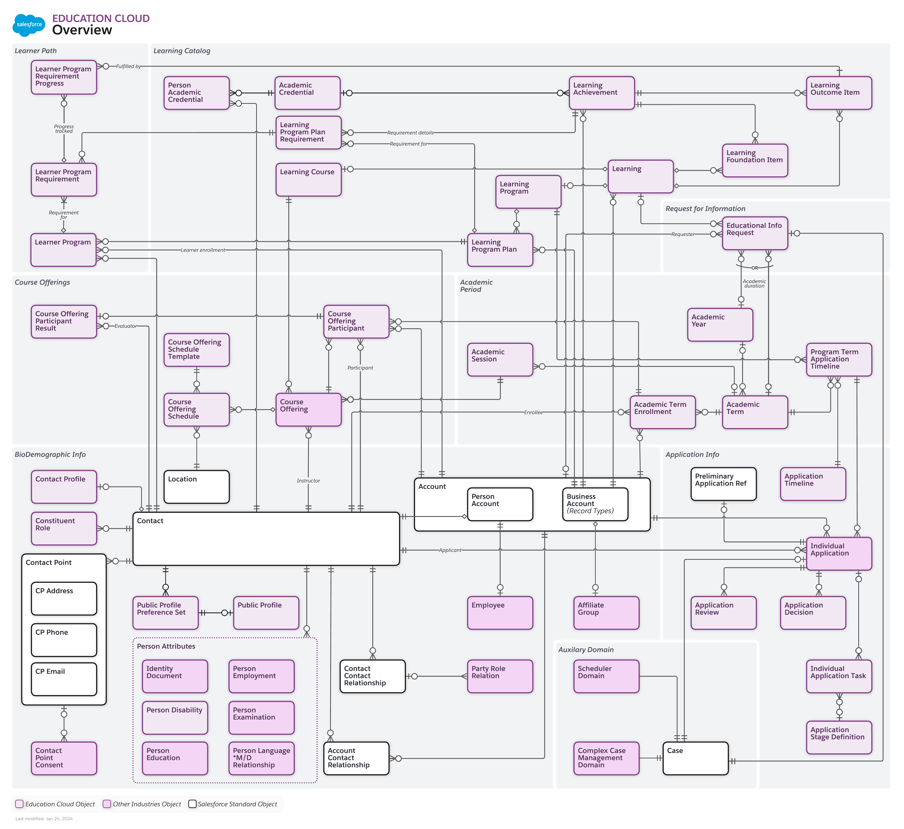

[Table of Contents](../Documentation.md)

# Salesforce Manufacturing Cloud

Salesforce Manufacturing Cloud is a platform that helps you manage your entire book-of-business and customer service lifecycle, while increasing collaboration and transparency between sales, operations, and partners.

## Who can use Manufacturing Cloud ?
Manufacturing Cloud can be used by companies in the manufacturing industry who want to manage their commercial operations, orchestrate their service experience, and streamline their partner engagement.
- Original equipment manufacturers (OEMs)
- Production suppliers
- Distribution or aftermarket manufacturers
- Process manufacturers
- Oil and gas producers
- Companies that manage run-rate, on-going, or long-term business
- Companies that want to orchestrate their service lifecycle
- Companies that want to drive greater partner engagement

## What are the benefit of Manufacturing Cloud ?
Manufacturing Cloud can help your business in various ways.

- Modernize your commercial operations
- Manage, grow, and forecast your entire top-line revenue
- Transform your service experiences
- Consolidate customer interactions into a single source-of-truth
- Simplify and strengthen your partner engagements
- Make faster, more informed decisions with actionable analytics

**More details to be added.**

## Licenses

# What's Included in Manufacturing Cloud?

Manufacturing Cloud includes industry-specific standard objects, features, tools, permission sets, apps, and other default configurations. The objects, features, and default assets available to you depend on whether you're using **Manufacturing Cloud for Sales**, **Manufacturing Cloud for Service**, or **Manufacturing Cloud for Sales and Service**.

## Here’s a detailed view of the features and functionality included in each offering:

| Feature or Functionality | Manufacturing for Sales | Manufacturing for Service | Manufacturing for Sales and Service |
|--|--|--|--|
| Sales Cloud functionality (Lead and opportunity management, pipeline forecasting) | ✅  | ❌ | ✅  |
| Sales Agreements | ✅  | ❌ | ✅  |
| Advanced Account Forecasting (uses Data Pipelines and Data Processing Engine) | ✅  Used to forecast run-rate and new business | ✅  Used to forecast service revenue and spare parts demand* | ✅  |
| Account Manager Targets | ✅  | ❌ | ✅  |
| Program Based Business | ✅  | ❌ | ✅  |
| Partner Visit Management (Visits and Action Plans) | ✅  | ❌ | ✅  |
| Flow for Manufacturing (OmniStudio, Decision Table, Document Generation, Business Rules Engine, and Data Processing Engine) | ✅  | ✅  | ✅  |
| Service Cloud functionality (Channel and case management) | ❌ | ✅  | ✅  |
| Warranty Lifecycle Management | ❌ | ✅  | ✅  |
| Service Console for Manufacturing | ❌ | ✅  | ✅  |
| Asset Service Console for Manufacturing | ❌ | ✅  | ✅  |
| Service console components (Action Launcher, Audit Trail, Identity Verification, Record Alerts, and Timeline) | ❌ | ✅  | ✅  |
| Voice of the Customer (Feedback Management) | ❌ | ✅  | ✅  |
| MuleSoft Accelerator for Manufacturing | ✅  (requires additional licenses) | N/A | ✅  (requires additional licenses) |
| CRM Analytics add-on | ✅  (requires additional licenses) | N/A | ✅  (requires additional licenses) |
| Experience Cloud Manufacturing partner portal template | ✅  (requires additional licenses) | N/A | ✅  (requires additional licenses) |
| Rebate Management add-on | ✅  (requires additional licenses) | ✅  (requires additional licenses) | ✅  (requires additional licenses) |
| Field Service | N/A | ✅  (requires additional licenses) | ✅  (requires additional licenses) |

*Note: "N/A" indicates not applicable, ✅ indicates included, and ❌ indicates not included.*

# Documentation

## Data Model
### Core Data Model

## Links

[Documentation](https://developer.salesforce.com/docs/atlas.en-us.edu_cloud_dev_guide.meta/edu_cloud_dev_guide/edu_cloud_intro.htm)
