[Table of Contents](../Documentation.md)

# Salesforce Health Cloud

Salesforce Health Cloud provides a rich set of standard and custom objects to store and access specialized health information.

## Licenses

**More details to be added.**

# Documentation
## Features
### Intelligent Documentation Automation
Simplify the document management process, reduce manual data entry, and get patients the right care and services faster by `managing patient and member forms all in one place, from intake through processing.` 

**Patients can upload their own documents** on an Experience Cloud site. You can **route forms automatically** to the right queue for faster review and processing in a digital, HIPAA-compliant workspace.

#### Object In Use
- **ReceivedDocument**: Represents a request to perform various operations on a document, including rotation, splitting, or extracting text.
- **ReceivedDocumentType**: Acts as a link between the Received Document and Document Type entities.
- **OcrDocumentScanResult**: Details the outcome of a document following the application of Optical Character Recognition (OCR) technology.
- **DocumentChecklistItem**: Denotes an item on the checklist for uploading documentation files.

### Health Assessments
Health Cloud Assessments use the power of Discovery Framework and OmniStudio to build more complex questionnaire paths.

#### Object In Use
- **AssessmentEnvelope**: Represents information about an envelope that contains the assessments related to a user. For example, you can create an envelope that contains assessments for a patient or a caregiver related to depression or anxiety.
- **AssessmentEnvelopeItem**: Describes an individual item within an assessment envelope, which includes assessments targeting user-specific issues, like depression or anxiety. This allows for the detailed capture and tracking of particular assessments within a broader evaluative framework.

### Intelligent Appointment Management
Scheduling and managing appointments is at the center of key patient engagement processes such as patient intake, cost estimation of services, patient education, and post-visit surveys. 

With the Health Cloud Intelligent Appointment Management's easy-to-use console, call center agents and care coordinators can efficiently and accurately schedule appointments.

This feature is using OmniStudio.

#### Alternatives:
- Salesforce Scheduler (Add-on)
- Third party application from App Exchange

#### Object In Use
- **AssessmentEnvelope**: Represents information about an envelope that contains the assessments related to a user. For example, you can create an envelope that contains assessments for a patient or a caregiver related to depression or anxiety.
- **AssessmentEnvelopeItem**: Describes an individual item within an assessment envelope, which includes assessments targeting user-specific issues, like depression or anxiety. This allows for the detailed capture and tracking of particular assessments within a broader evaluative framework.

## Data Model
### Advanced Therapy Management
Advanced Therapy Management helps streamline complex procedures that involve multiple appointments across different locations.\
Use `Advanced Therapy Management’s Multi-Step Scheduling solution` for easy scheduling of appointments for program participants.

Configure procedure steps based on lead times and set up affiliated **service territories**  to establish where work types are sequentially performed.
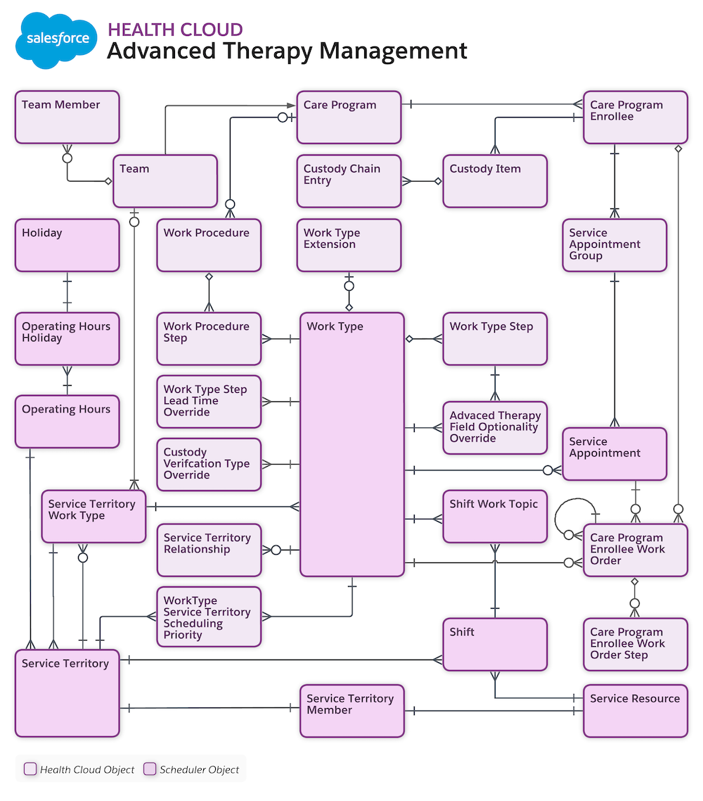
[Official Documentation](https://developer.salesforce.com/docs/atlas.en-us.health_cloud_object_reference.meta/health_cloud_object_reference/hc_advanced_therapy_management_data_model.htm)

### Benefit Verification
The benefits verification data model supports providers, payers, and life sciences organizations in determining benefits coverage for services and products provided.
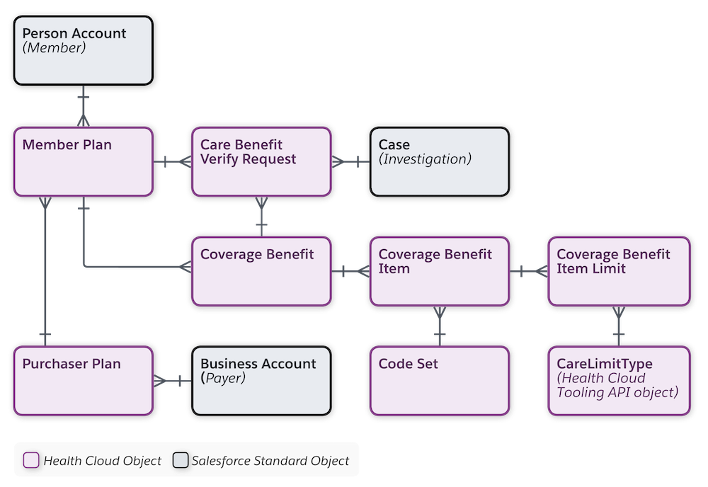

[Official Documentation](https://developer.salesforce.com/docs/atlas.en-us.health_cloud_object_reference.meta/health_cloud_object_reference/hc_benefits_verification_data_model.htm)

### Care Management
Clinical data from electronic health records (EHR) or other clinical systems is critical to planning, executing, and managing coordinated care plans for patients. You can integrate clinical data with Salesforce using several standard APIs to map messages from EHR systems into Health Cloud objects and fields.
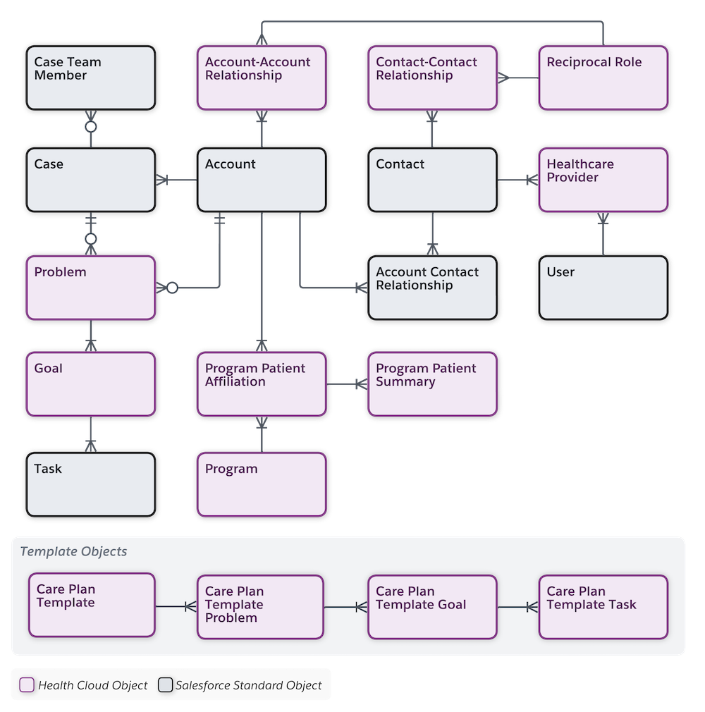

[Official Documentation](https://developer.salesforce.com/docs/atlas.en-us.health_cloud_object_reference.meta/health_cloud_object_reference/hc_care_management_data_model.htm)

### Care Program Management
Drive increased adherence and improve patient outcomes using the care program management data model. Now you can enroll and manage patients to achieve the maximum impact of your programs.
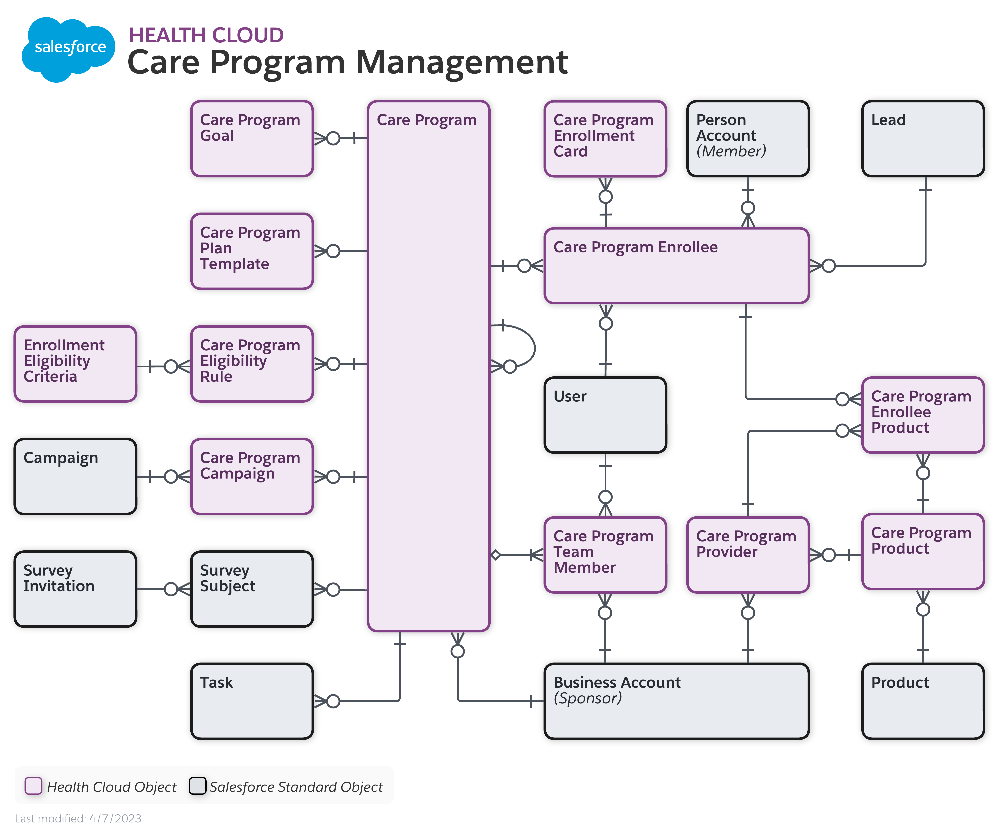

[Official Documentation](https://developer.salesforce.com/docs/atlas.en-us.health_cloud_object_reference.meta/health_cloud_object_reference/hc_care_program_data_model.htm)

### Claims
A claim is information submitted to an individual's health insurance company by an entity providing a service, medication or device.
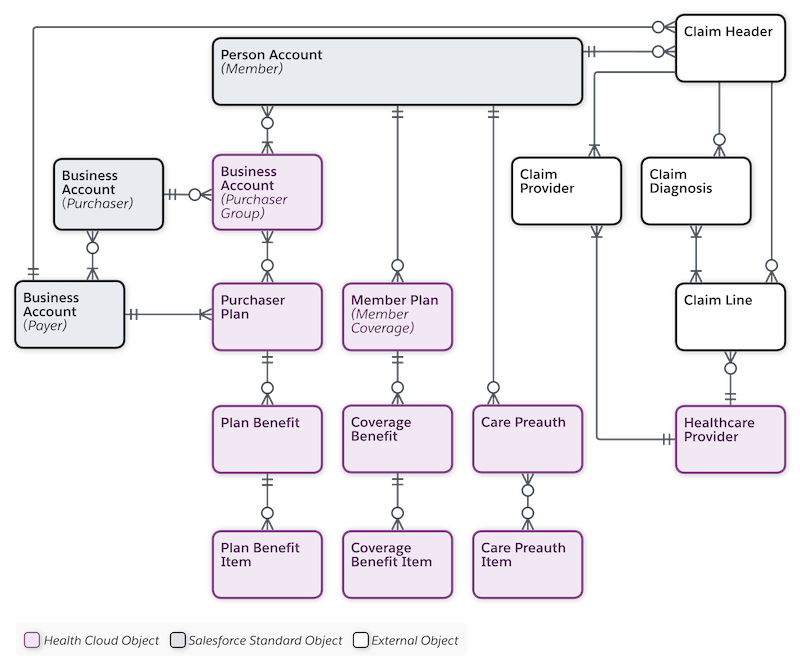

[Official Documentation](https://developer.salesforce.com/docs/atlas.en-us.health_cloud_object_reference.meta/health_cloud_object_reference/hc_claims_data_model.htm)

### Health Insurance
The health insurance data model provides objects for managing the ways care is paid for. It represents information about participants such as employment, insurance coverage, and dependents. You can manage details of the benefits provided by plans to members and treatment preauthorization requests made by members or providers.

[Official Documentation](https://developer.salesforce.com/docs/atlas.en-us.health_cloud_object_reference.meta/health_cloud_object_reference/hc_membership_data_model.htm)

### Home Health
The Home Health data model helps you store data for your organization’s home healthcare services. You can store the preferences patients have for their services, the skills your resources possess, the details of each home visit, and so on. The Home Health data model is primarily built over the Salesforce Field Service data model and uses many of its objects.

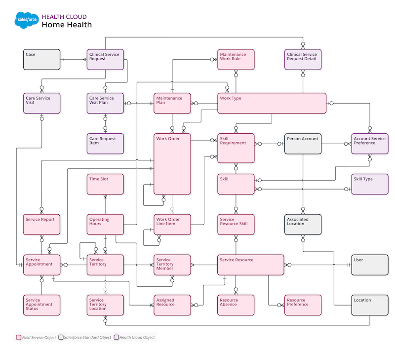

[Official Documentation](https://developer.salesforce.com/docs/atlas.en-us.health_cloud_object_reference.meta/health_cloud_object_reference/hc_api_home_health.htm)

### Integrated Care Management
Integrated Care Management provides an improved data model to store clinical data related to a patient or member’s care plans. This data model is both USCDI and FHIR R4-aligned, which helps with your system’s interoperability.

With the objects in this data model, you can define a PGI library for your organization’s care plans, define care plan templates, and store care plans for patients or members. You can also store other information like episodes of care.

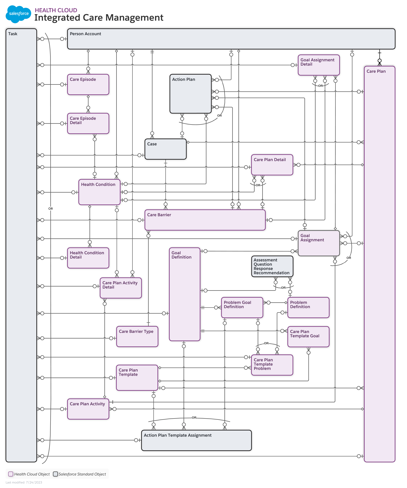

[Official Documentation](https://developer.salesforce.com/docs/atlas.en-us.health_cloud_object_reference.meta/health_cloud_object_reference/hc_dev_integrated_care_management.htm)

### Intelligent Appointment Management
Health Cloud integrates with a customer’s appointment management system to provide a patient appointment booking experience in Salesforce for call center agents and care coordinators. The Health Cloud data model for appointments enables you to work with multiple source systems operating on different electronic health record platforms.

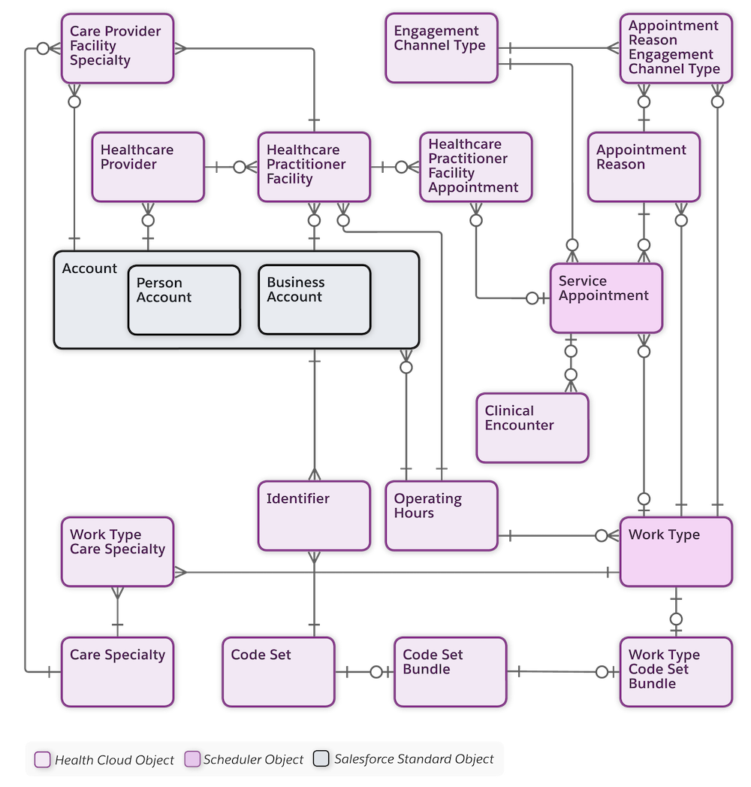

[Official Documentation](https://developer.salesforce.com/docs/atlas.en-us.health_cloud_object_reference.meta/health_cloud_object_reference/hc_appointment_management_data_model.htm)

### Medication Management
The Medication Management data model provides objects to enable providers, care coordinators, and clinicians to perform a medication reconciliation and medication therapy review of their patients’ medication regimen. \
The data model provides objects for managing information on medication reconciliations, medication recommendations, and comprehensive and targeted medication reviews conducted for patients.

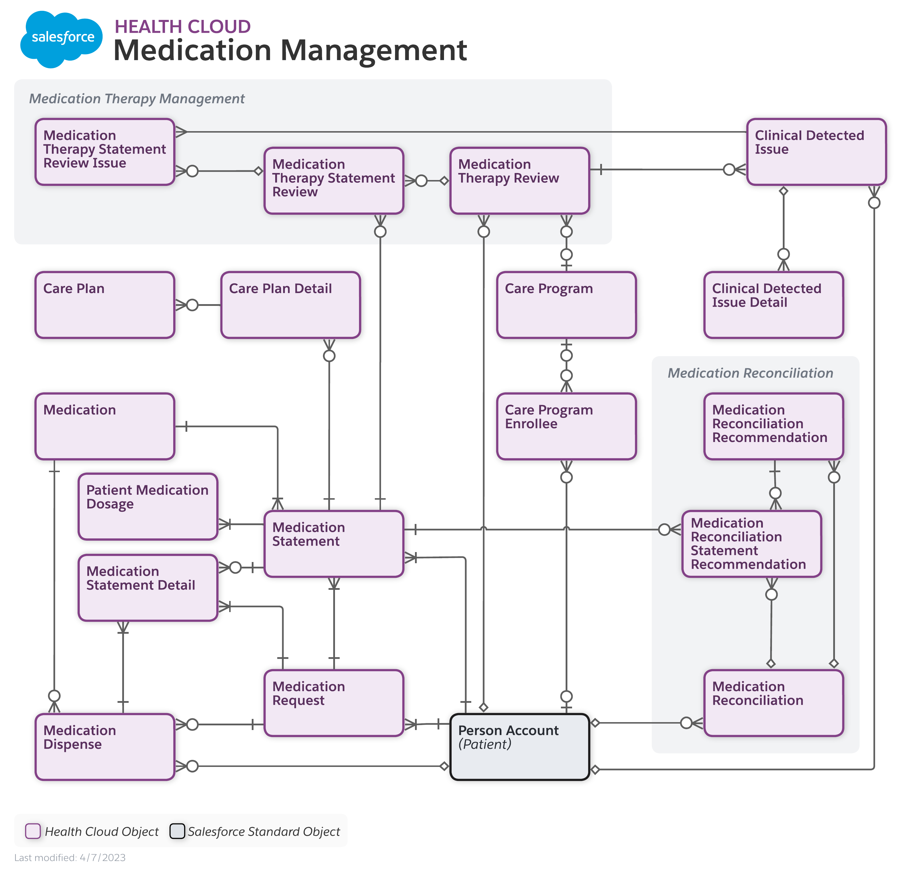

[Official Documentation](https://developer.salesforce.com/docs/atlas.en-us.health_cloud_object_reference.meta/health_cloud_object_reference/hc_medication_review_data_model.htm)

### Provider Network Management
Provider Network Management allows health insurance companies to bring providers into their network and helps members or patients find care that fits their needs. It provides objects for managing provider networks and contract payment agreement terms.

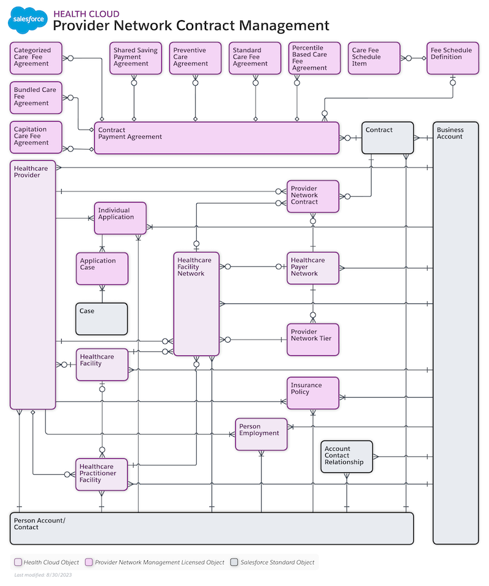

[Official Documentation](https://developer.salesforce.com/docs/atlas.en-us.health_cloud_object_reference.meta/health_cloud_object_reference/hc_pnm_data_model.htm)

### Remote Monitoring and Device Registration
The remote monitoring and device registration data model provides objects for managing data collected from devices issued to patients or program members, such as smart watches and heart monitors.

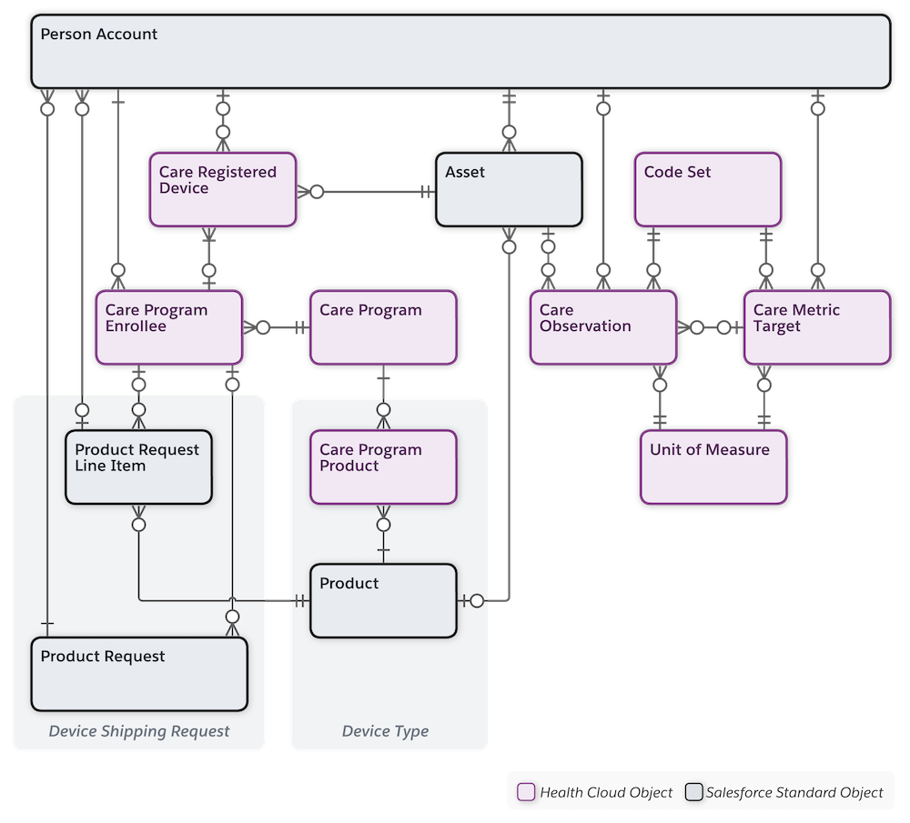

[Official Documentation](https://developer.salesforce.com/docs/atlas.en-us.health_cloud_object_reference.meta/health_cloud_object_reference/hc_remote_monitoring_data_model.htm)

## Links

