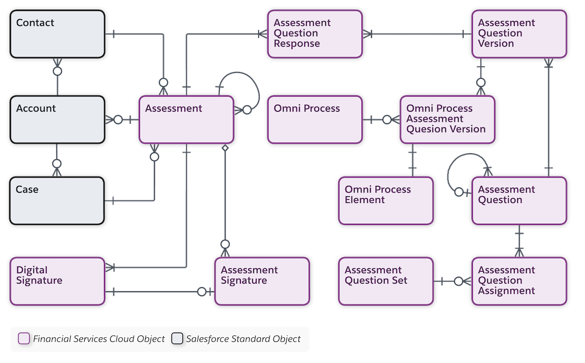

[Table of Contents](../Documentation.md)

# Industry cloud shared features

## Discovery Framework and Assessments
By using the Discovery Framework data model, your users can collect and validate customer information in compliance with your policies. Use the Discovery Framework for needs analysis, digital onboarding, and more.

Discovery Framework is using `OmniStudio & Omniscript Designer to create form with custom logic, etc`.

Quickly locate the correct assessment and complete it by using the `Assessment component`. If you must pause an assessment in progress, save it as a draft. You can easily find it later and complete it at your convenience.

The Assessment component shows selected assessments and a library of available assessments. You can filter selected assessments based on whether they're:
- Completed: Submitted by a respondent
- Not Started: Pending a response
- In Progress: Saved as a draft
- Expired: Not submitted before the expiration date

### Availability
- **Financial Services Cloud**
- **Health Cloud**
- **Public Sector Solutions**

**Note:** Discovery Framework is compatible with only OmniStudio standard objects model

### Alternative
- Salesforce Survey (But limited)
- Third party application from App Exchange

### Data Model

[Official Documentation](https://help.salesforce.com/s/articleView?id=sf.fsc_admin_setup_and_configure_discovery_framework.htm&language=en_US&type=5)

## Decision Table

Define business rules and let decision tables decide the outcome. Decision tables read business rules and decide the outcome for records in your Salesforce org or for the values that you specify. 

A decision table can read up to 100,000 business rules and provide outputs based on your requirements.

### Availability
- **All Industry Cloud**

### Alternative
- Custom solution with CustomObject and Flow/Apex logic
- Third party application from App Exchange

## Document Tracking and Approvals

Create a document checklist item for each file required from a customer. A customer or user then uploads a relevant file for the document checklist item, and the files are tracked through an approval process. 
Customers upload new versions of rejected documents and track the progress of their uploaded documentation from submission to approval.

### Availability
- **All Industry Cloud**

### Alternative
- Custom solution with CustomObject and Flow/Apex logic
- Third party application from App Exchange

## Intelligent Form Reader
Intelligent Form Reader uses optical character recognition to automatically extract data using Amazon Textract. 

You can specify the document type that can be associated with the uploaded document, upload the document, and map the document’s fields to the appropriate Salesforce data object’s fields. 

For example, you can specify that a patient's birth date in a referral form must be stored in the Birthdate field of the patient's Contact record. The extracted information can be used to create or update record fields, or to verify data that's already in the org. **For example, you can check a person’s birth date against the birth date in their scanned passport.**

### Availability
- **All Industry Cloud** (With extra cost)

### Alternative
- Custom solution with CustomObject and Flow/Apex logic
- Third party application from App Exchange