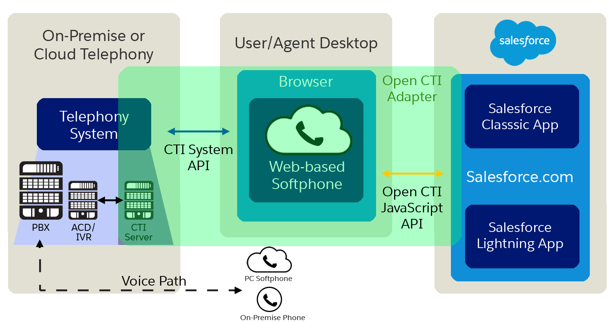

[Table of Contents](../Documentation.md)

# CTI Solutions

Integrating a telephony system with Salesforce requires using a CTI (Computer Telephony Integration) solution. AppExchange hosts several CTI solutions, typically specific to certain telephony providers.

Best practice suggests exploring AppExchange for a solution that matches your telephony system before considering custom development with Open CTI.

## Salesforce Terminologies

| Term       | Description                                                                                   |
|------------|-----------------------------------------------------------------------------------------------|
| Softphone  | An on-screen phone for making and receiving calls.                                             |
| Call Center| A Salesforce feature integrating with call systems developed by partners or developers.       |
| Open CTI   | A JavaScript API for building cloud-based call systems used with Salesforce's Call Center.    |

### Resources

1. [Open CTI Documentation](https://developer.salesforce.com/docs/atlas.en-us.api_cti.meta/api_cti/sforce_api_cti_intro.htm)

## Key Features of Open CTI

- Receiving and making calls
- Searching and displaying records in the softphone layout
- Saving Salesforce records
- Executing Apex

## Integration

- JavaScript Library
    - Compatible with Visualforce or any other web technology (LWC is not yet fully supported, except for click-to-dial)
- Lightning message

### Softphone

A softphone is a customizable call-control tool available to users assigned to a call center. Its functionality and user interface are configured by Salesforce admins.
The softphone integrates with Salesforce via an IFrame and is provided by the Telephony system, configured in Salesforce under **Call Centers**.

## Licenses

1. Open CTI (Available without extra cost)
2. Sales Dialer (Sales & Service cloud with an **extra add-on license**)
    - ❌ Limited to the US and Canada ❌

## List of Solutions (Sample)

This is a non-exhaustive list of solutions available on AppExchange:

1. **AirCall CTI**
    - Web-based softphone (also available on mobile via an app)
    - Monitoring and listening to live agents, measuring KPIs
    - Integration with other systems (Help Desk, etc.)
    - SMS capabilities
    - [App Exchange Link](https://appexchange.salesforce.com/appxListingDetail?listingId=a0N3A00000EFnzwUAD)

## Documentation

1. [Trailhead - Service Cloud Call Center Basics](https://trailhead.salesforce.com/content/learn/modules/service_call)
