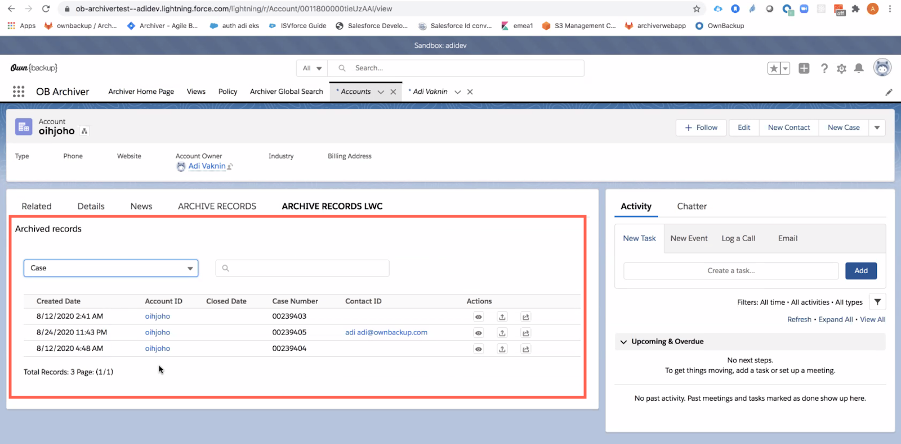

[Table of Contents](../Documentation.md)
# Archiving

## Different Archiving Stategies

When archiving, you should decide if you store the data in Salesforce `Big Objects` or outside Salesforce in an DataWarehouse or DataLake.
It's recommended to avoid Big Objects for the CTA exam as it's easier to justify.

Data can be archived in any data solution such as : 
- DataLake: `Amazon S3 Bucket` (Data & Files)
- DataWarehouse: `Snowflake` (Data & Files)

## Archive LDV records
It's important to archive LDV records to avoid degrading the performance of your orgs.

## Salesforce Solution
No Specific salesforce product but solutions can be found on App Exchange to archive data from Salesforce in Big Objects and make them available via LWC components.

## External Solutions

### Own - Data Archive
Solutions such as `Own - Data Archive` are ideal to manage archiving schedules and store the data in Amazon S3.\
`Own Data Archive` is available in App Exchange.

`Own Data Archive` also provide `Data virtualization` via a library of Lightning components that you can insert in your lightning apps.

### Own - Data Archive

# Backup Solution
## Salesforce Solution - Salesforce Backup
Salesforce is providing a solution called `Salesforce Backup` that can be used to manage Backup directly from Salesforce and control the schedule of backups.\
Data are stored in AWS and migrated there using the `Bulk API `(Web Server flow)

The only important aspect to take into consideration is that backup can only be `Daily` and `Files aren't supported` yet (November 2023) so it's not enterprise ready.

## External Solution
Solutions such as `Own - Backup` are ideal to manage archiving schedules and store the data in Amazon S3.\

## Custom Built Solution

